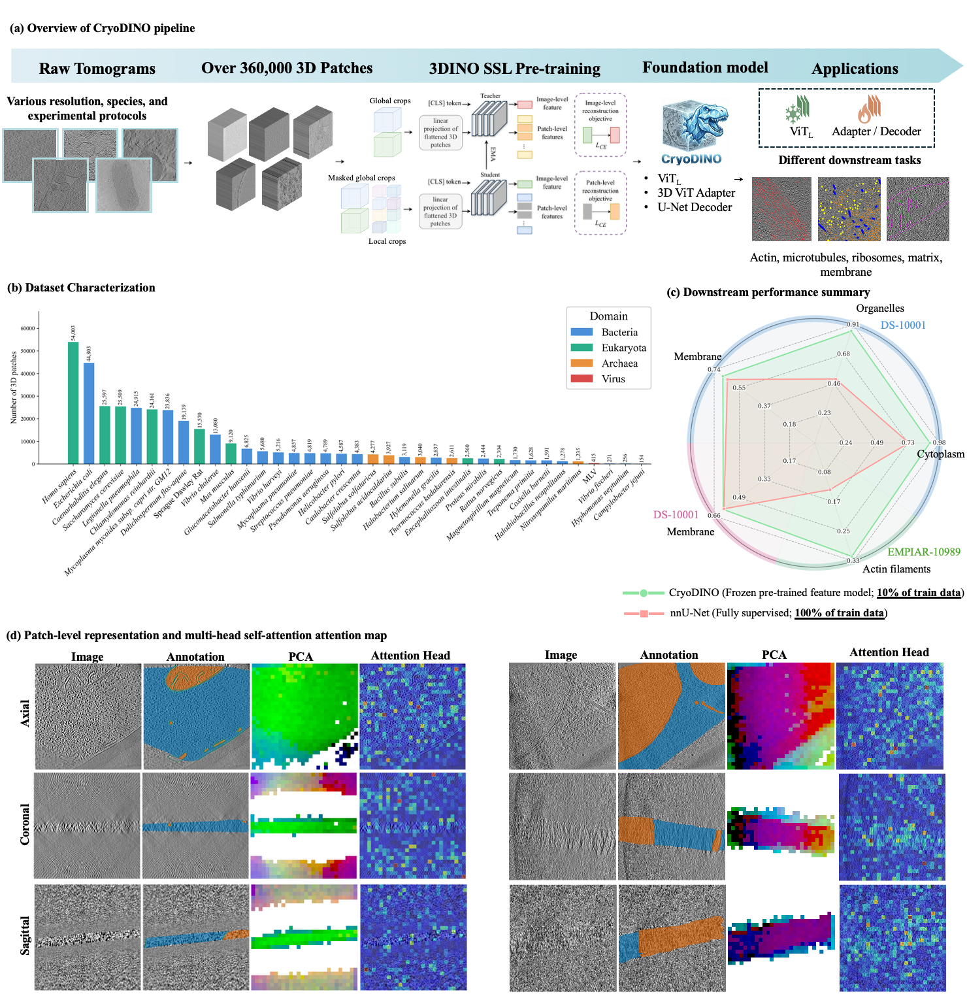

# CryoDINO

**CryoDINO** is a 3D self-supervised learning (SSL) foundation model for Cryo-Electron Tomography (CryoET). It adapts the [3DINO](https://www.nature.com/articles/s41746-025-01455-6) framework — a 3D extension of DINOv2 — to learn general-purpose volumetric representations from unlabeled biological tomograms. The pretrained backbone transfers to downstream tasks such as organelle segmentation with strong data efficiency.

<p align="center">
  
</p>

**Key facts:**
- Pretrained on **360,000+ 3D patches** spanning bacteria, eukaryota, archaea, and viruses
- ViT-Large backbone with 16³ patch tokenization (1024-dim, 24 blocks)
- Three SSL objectives: **DINO** (view consistency) + **iBOT** (masked patch prediction) + **KoLeo** (diversity)
- Two-stage pretraining: standard 96³ crops → high-resolution 112³ adaptation
- With only **10% of labeled data**, CryoDINO matches or exceeds nnU-Net trained on **100% of data**

---

## Table of Contents

1. [Pipeline Overview](#pipeline-overview)
2. [Installation](#installation)
3. [Pretraining](#pretraining)
4. [Fine-tuning](#fine-tuning)
   - [Downstream Patch Generation](#downstream-patch-generation)
   - [Configuration](#configuration)
   - [Sample Fine-tuning Script](#sample-fine-tuning-script-slurm)
5. [Inference](#inference)
6. [Visualization](#visualization)
7. [License](#license)
8. [Citation](#citation)

---

## Pipeline Overview

```
Raw CryoET Tomograms (.nii / .nii.gz)
         │
         ▼
preprocessing/subtomograms_generation.py
  → Non-overlapping 128³ patches (.pt), Otsu foreground filtering
         │
         ▼
preprocessing/create_pretrain_json.py
  → pretrain.json  (image path + spacing metadata)
         │
         ▼
[Pretraining — done, checkpoints available below]
  3DINO/dinov2/train/train3d.py
  Stage 1: 125,000 iters @ 96³ crops  (~5 days, 4× H100-80GB)
  Stage 2: 12,500 iters  @ 112³ crops (high-res adaptation, ~2 days)
         │
         ▼
preprocessing/downstream_patch_generation.py
  → image+label 512³ patches (.pt) for fine-tuning
         │
         ▼
3DINO/dinov2/eval/segmentation3d.py
  → Fine-tune segmentation head (Linear / UNETR / ViTAdapter-UNETR)
         │
         ▼
inference/segmentation3d_inference.py
  → Sliding-window inference → predicted masks (.nii.gz)
```

---

## Installation

**Requirements:** Python 3.9, CUDA 12.1, conda

**Option A — conda (recommended, exact environment)**

```bash
git clone https://github.com/<your-org>/CryoDINO.git
cd CryoDINO

# The prefix line in environment.yml is cluster-specific — conda will ignore it
# and install into your default envs directory
conda env create -f environment.yml
conda activate cryoet
```

**Option B — pip into an existing Python 3.9 environment**

```bash
pip install -r requirements.txt
```

> **Note:** `requirements.txt` and `environment.yml` reflect the exact environment used for all experiments (`torch==2.1.0+cu121`, `xformers==0.0.22.post4`, `monai==1.3.0`). Using different versions may require adjustments.

> **GPU memory:** Pretraining requires 4× H100/H100-80GB. Fine-tuning and inference run on a single GPU (200GB RAM recommended).

---

## Pretraining

> Pretraining is already done. Download the checkpoints below and proceed to [Fine-tuning](#fine-tuning).

### What we used

**Data.** Raw CryoET tomograms from 37 species (bacteria, eukaryota, archaea, viruses) were collected from public repositories including CZII and EMPIAR. Each tomogram was split into non-overlapping **128³ voxel patches** using `preprocessing/subtomograms_generation.py`, which applies Otsu thresholding to discard empty background patches. Over 360,000 patches were retained across all datasets. A JSON manifest was then generated with `preprocessing/create_pretrain_json.py` to supply file paths and voxel spacing to the data loader.

**Model.** A 3D Vision Transformer (ViT-Large) with 16³ patch tokenization, 24 transformer blocks, and 1024-dim embeddings. Memory-efficient attention is provided by [xFormers](https://github.com/facebookresearch/xformers).

**Training.** Two-stage self-supervised pretraining using DINO + iBOT + KoLeo losses:

| Stage | Config | Crops | Batch/GPU | Iterations | Hardware |
|-------|--------|-------|-----------|-----------|----------|
| 1 — Standard | `ssl3d_default_config.yaml` | 96³ global, 48³ local ×8 | 143 | 125,000 | 4× H100-80GB |
| 2 — High-res | `vit3d_highres.yaml` | 112³ global, 64³ local ×8 | 64 | 12,500 | 4× H100-80GB |

Stage 2 is initialized from the Stage 1 teacher checkpoint and runs for ~1 day to adapt the model to higher-resolution inputs.

### Checkpoints

| Checkpoint | Stage | Iterations | Notes |
|------------|-------|-----------|-------|
| `teacher_checkpoint_stage1.pth` | 1 | 112,499 | Standard 96³ pretraining |
| `teacher_checkpoint_stage2.pth` | 2 | 9,374 | High-res 112³ adaptation **(recommended)** |

> **Download:** _[Link coming soon — checkpoints will be hosted on Zenodo / HuggingFace Hub]_

Place downloaded checkpoints under:
```
experiments/
└── ssl3d_run_h100_high_res/
    └── eval/
        └── training_9374/
            └── teacher_checkpoint.pth
```

---

## Fine-tuning

### Downstream Patch Generation

For fine-tuning, tomograms are split into **512³ voxel patches** (larger than pretraining to preserve spatial context for the segmentation decoder). Only patches with at least 1% foreground label voxels are kept.

```bash
# Percentile normalization [0.5–99.5] → [-1, 1]  (default)
python preprocessing/downstream_patch_generation.py \
    --datalist-json /path/to/Dataset001_100_datalist.json \
    --output-dir    /path/to/Dataset001_patches512/ \
    --patch-size    512

# Z-score normalization
python preprocessing/downstream_patch_generation.py \
    --datalist-json /path/to/Dataset001_100_datalist.json \
    --output-dir    /path/to/Dataset001_patches512/ \
    --patch-size    512 \
    --zscore

# Different XY and Z patch sizes (e.g. for anisotropic volumes)
python preprocessing/downstream_patch_generation.py \
    --datalist-json /path/to/Dataset001_100_datalist.json \
    --output-dir    /path/to/Dataset001_patches512/ \
    --patch-size    512 --patch-size-z 128 \
    --fg-threshold  0.01
```

The input `datalist.json` must follow the structure:
```json
{
  "training":   [{"image": "...", "label": "..."}],
  "validation": [{"image": "...", "label": "..."}],
  "test":       [{"image": "...", "label": "..."}]
}
```

**Output:**
```
Dataset001_patches512/
├── images/   # <name>_patch_<x>_<y>_<z>.pt
├── labels/   # matching label patches
└── Dataset001_patches_100_datalist.json
```

---

### Configuration

Fine-tuning uses the high-resolution config (`3DINO/dinov2/configs/train/vit3d_highres.yaml`) as the backbone config, then passes segmentation-specific arguments via CLI:

```yaml
# vit3d_highres.yaml — used as backbone config for fine-tuning
student:
  full_pretrained_weights: '/path/to/stage1/teacher_checkpoint.pth'
crops:
  global_crops_size: 112
  local_crops_size: 64
train:
  batch_size_per_gpu: 64
  OFFICIAL_EPOCH_LENGTH: 125
optim:
  base_lr: 0.001
```

**Segmentation head options:**
- `Linear` — single linear layer on frozen ViT [CLS] token
- `UNETR` — U-shaped decoder with frozen ViT encoder (recommended)
- `ViTAdapterUNETR` — spatial adapter modules injected into ViT + UNETR decoder (best for challenging datasets)

Add `--train-feature-model` to unfreeze the ViT backbone for full fine-tuning.

---

### Sample Fine-tuning Script (SLURM)

```bash
#!/bin/bash
#SBATCH -J cryodino-finetune
#SBATCH --nodes=1
#SBATCH --gres=gpu:1
#SBATCH --cpus-per-task=24
#SBATCH --mem=200G
#SBATCH -t 6-00:00:00

source ~/.bashrc
conda activate cryodino

cd /path/to/CryoDINO/3DINO || exit 1

CONFIG_FILE="dinov2/configs/train/vit3d_highres.yaml"
PRETRAINED_WEIGHTS="/path/to/teacher_checkpoint.pth"
OUTPUT_DIR="/path/to/experiments/finetuning/Dataset001_UNETR"
DATASET_NAME="Dataset001_CZII_10001_patches512"
BASE_DATA_DIR="/path/to/experiments"
CACHE_DIR="/path/to/cache"

mkdir -p "$OUTPUT_DIR" "$CACHE_DIR"

OMP_NUM_THREADS=1 MKL_NUM_THREADS=1 NUMEXPR_NUM_THREADS=1 \
PYTHONPATH=. python dinov2/eval/segmentation3d.py \
  --config-file        "$CONFIG_FILE" \
  --output-dir         "$OUTPUT_DIR" \
  --pretrained-weights "$PRETRAINED_WEIGHTS" \
  --dataset-name       "$DATASET_NAME" \
  --dataset-percent    100 \
  --base-data-dir      "$BASE_DATA_DIR" \
  --segmentation-head  UNETR \
  --epochs             100 \
  --epoch-length       300 \
  --eval-iters         600 \
  --warmup-iters       3000 \
  --image-size         112 \
  --batch-size         2 \
  --num-workers        10 \
  --learning-rate      1e-4 \
  --cache-dir          "$CACHE_DIR" \
  --resize-scale       1.0
```

---

## Inference

Run sliding-window inference on new tomograms using a pretrained backbone and fine-tuned segmentation head.

**Mode 1: JSON datalist (uses `test` split)**
```bash
python inference/segmentation3d_inference.py \
    --config-file        3DINO/dinov2/configs/train/vit3d_highres.yaml \
    --pretrained-weights /path/to/teacher_checkpoint.pth \
    --checkpoint         /path/to/finetuning/Dataset001_UNETR/best_model.pth \
    --segmentation-head  UNETR \
    --image-size         112 \
    --num-classes        4 \
    --datalist           /path/to/Dataset001_100_datalist.json \
    --output-dir         /path/to/inference_output/ \
    --overlap            0.75 \
    --batch-size         1
```

**Mode 2: Directory of NIfTI files**
```bash
python inference/segmentation3d_inference.py \
    --config-file        3DINO/dinov2/configs/train/vit3d_highres.yaml \
    --pretrained-weights /path/to/teacher_checkpoint.pth \
    --checkpoint         /path/to/best_model.pth \
    --segmentation-head  UNETR \
    --image-size         112 \
    --num-classes        4 \
    --input-dir          /path/to/tomograms/ \
    --label-dir          /path/to/labels/ \
    --output-dir         /path/to/inference_output/
```

> `--label-dir` is optional. When provided, per-image and mean Dice scores are computed and saved to `metrics.json`.

**Outputs:**
```
inference_output/
├── <tomogram_name>.nii.gz   # predicted segmentation mask (uint8)
└── metrics.json             # per-image and mean Dice scores (if labels provided)
```

---

## Visualization

### PCA Feature Maps & Attention Maps

Visualize patch-level PCA representations and multi-head self-attention from the pretrained backbone on a single tomogram:

```bash
cd 3DINO

# PCA of patch features (axial / coronal / sagittal slices)
PYTHONPATH=. python dinov2/eval/vis_pca_cryoet.py \
    --config-file        dinov2/configs/train/vit3d_highres.yaml \
    --pretrained-weights /path/to/teacher_checkpoint.pth \
    --image-path         /path/to/tomogram.nii.gz \
    --output-dir         /path/to/vis_output/ \
    --vis-type           pca \
    --image-size         112

# Multi-head self-attention maps
PYTHONPATH=. python dinov2/eval/vis_pca_cryoet.py \
    --config-file        dinov2/configs/train/vit3d_highres.yaml \
    --pretrained-weights /path/to/teacher_checkpoint.pth \
    --image-path         /path/to/tomogram.nii.gz \
    --output-dir         /path/to/vis_output/ \
    --vis-type           attention \
    --image-size         112
```

Output images are saved as axial, coronal, and sagittal slices in `--output-dir`.

### Unsupervised Visualization Notebook

An interactive notebook for exploring learned representations without labels — runs sliding-window feature extraction, applies PCA, and displays RGB projections alongside raw tomogram slices:

```bash
jupyter notebook visualization/unsupervised_vis.ipynb
```

---

## License

This project is licensed under the **Creative Commons Attribution-NonCommercial-NoDerivatives 4.0 International (CC BY-NC-ND 4.0)** license.

- You may share and use this work for **non-commercial research** with proper attribution.
- You may **not** distribute modified versions or use it commercially.

See [LICENSE](LICENSE) for the full terms.

---

## Citation

If you use CryoDINO in your research, please cite:

```bibtex
@article{cryodino2025,
  title   = {CryoDINO: A 3D Self-Supervised Foundation Model for Cryo-Electron Tomography},
  author  = {Attarpour, Ahmadreza and others},
  year    = {2025}
}
```

The underlying 3DINO framework:
```bibtex
@article{3dino2025,
  title   = {3D self-supervised learning for medical imaging},
  journal = {npj Digital Medicine},
  year    = {2025}
}
```

---

<p align="center">
  Developed by <a href="mailto:attarpour1993@gmail.com">Ahmadreza Attarpour</a>
</p>
